# My_NixieClock

更好的阅读体验：[DIY辉光管时钟记录 | Krocz's Blog](https://krocz.github.io/2023/08/31/DIY辉光管时钟记录/)

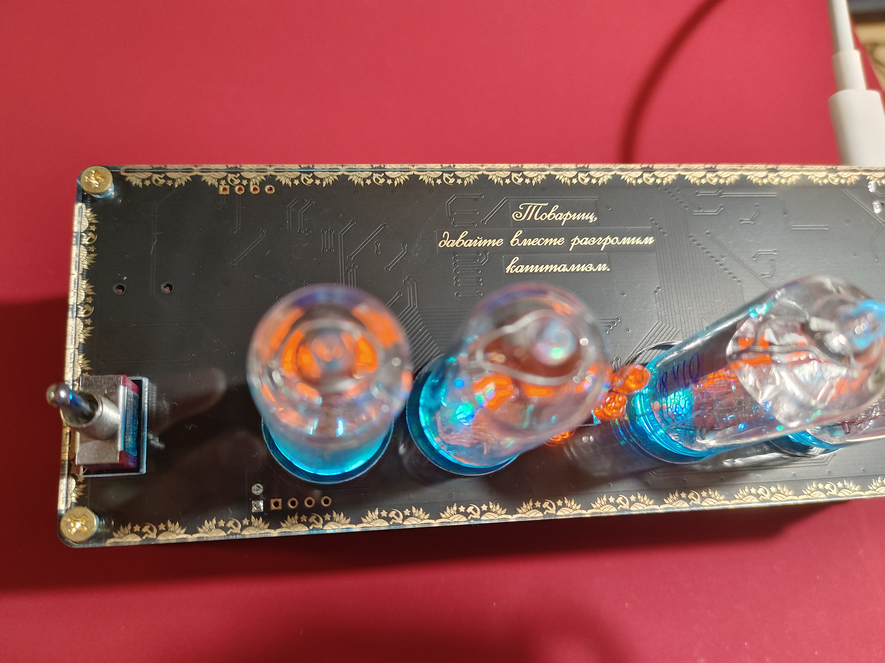

## 1.功能

- 4位时间/日期显示
- 4位温湿度显示
- 蜂鸣器播放歌曲
- WiFi联网时间校正
- 可编程氛围灯

## 2. 硬件选型

- 主控：stm32f103c8t6
- 辉光管：in14
- 辉光管主控：HV57708
- 温湿度：GXHT30
- 时钟芯片：DS1302
- 氛围灯：WS2812C
- WiFi模块：ESP-12F
- 蜂鸣器：5020贴片蜂鸣器


## 3.设计

### 3.1 PCB设计

PCB 使用立创EDA-标准版进行设计的，整体的 PCB 布局如下：

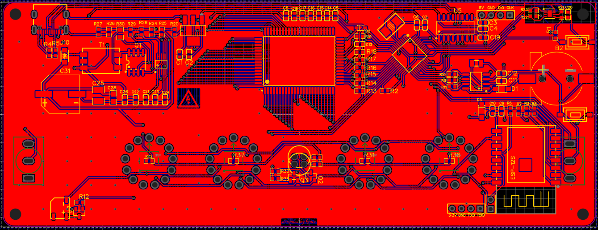

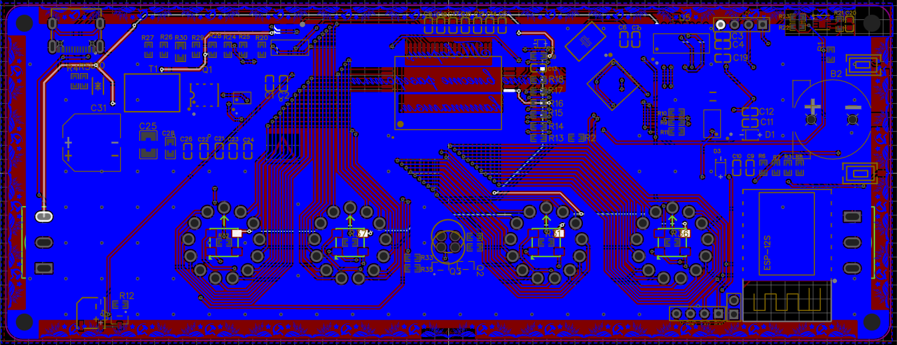


#### 3.1.1 基于MAX668的升压方案

辉光管时钟的PCB设计大致可以分为主控的外围电路，传感器外围电路和升压电路三部分。前两部分基本上都有非常简单而且成熟电路可以参考，萌新的第一块成品板就是STM32最小系统板，所以这一块问题倒是不大。最难的还是170伏升压电路的设计，由于缺乏电路知识和设计经验，所以直接不求甚解拿来主义。为了能够方便直接使用Type-C进行供电，并没有选择用的非常多的MAX1771升压方案（该方法需要12V的输入电压），使用下面这位作者的方案：

> [kratosxs(考研停更中) - 嘉立创EDA开源硬件平台 (oshwhub.com)](https://oshwhub.com/kratosxs?tab=home&page=1)

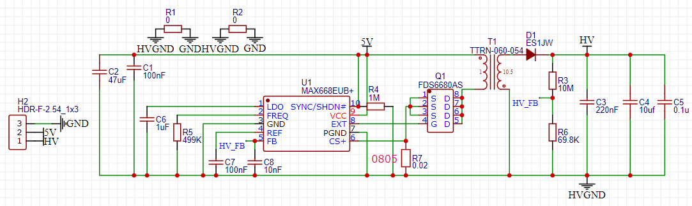


##### 3.1.1.1 出现的问题

上面那位作者已经删除了该工程，不过在另一位作者的博客中我找到了类似的设计，甚至连出现的问题都是类似的，都是升压电路的输出电压远达不到170V，仅有60~70V。

> [基于 MAX668 的辉光管升压方案 | 米米的博客 (zhangshuqiao.org)](https://zhangshuqiao.org/2023-04/基于MAX668的辉光管升压方案/)

我的升压电路PCB设计如下：

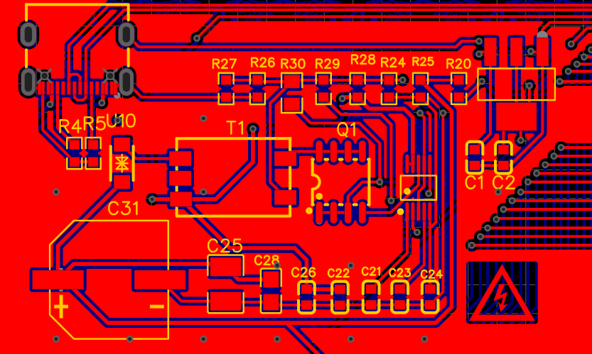

至于设计中存在的问题，还是得找学电路的朋友帮忙看看。


#### 3.1.2 WiFi模块的PCB设计

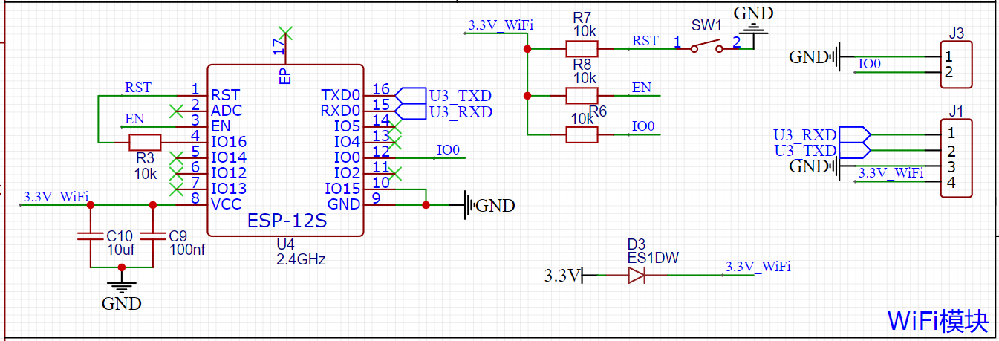

在WiFi模块的设计中，主要存在的问题有两个：

1. 设计上想使用UART来发送AT指令来驱动WiFi模块的，但是接线的时候按理来说WiFi模块和STM32的TXD和RXD应该叉接的，结果我把TXD连TXD、RXD连RXD了，设计的时候太不走心了。
2. 在主供电`3.3V`和WiFi模块供电`3.3V_WiFi`之间使用了一个二极管来进行隔离，本意是想要在WiFi模块烧写程序时插针的供电不会影响到其他模块，但是问题是实际使用主供电时，在该二极管的两侧会产生约0.8V的压降，从而导致WiFi模块的供电电压过低无法驱动。去掉这个二极管，短接引脚之后就没有问题了。

作为萌新的第二块成品板，还是有点复杂了，最终打板测试的时候出现了很多问题，有的是连线失误，有的就是完全缺乏电路知识背景，在设计之初就完全没有考虑到的问题。即使在立创的开源社区中有很多的可参考设计，但是涉及到复杂的电路部分（像这次的升压电路），我想，下一次还是选择成品模块进行直接贴片吧。毕竟没有相关知识，出现了问题调试起来是真的无从下手。


### 3.2 程序设计

主控是 stm32F103，基于stm32 的标准库进行开发。

#### 3.2.1 辉光管驱动-HV57708

比较复杂的就是辉光管的驱动芯片的编码，所以先来进行介绍。

HV57708 是一个可以承受高电压的高速串行转并行输出的芯片，最高支持 64 个通道的输出。对于每个 in14 辉光管而言有 12 个控制引脚，则一个 HV57708 芯片可以控制 4 个全功能的辉光管，6 个可以输出所有数字的辉光管。

HV57708的几个功能引脚的作用如下：

- $\overline{LE}$：移位寄存器的锁存信号，低电平有效，锁存时无论输入如何变化，寄存器的值不会发生变化

- $\overline{BL}$：翻译过来叫“消隐”信号，看功能图当该信号处于低电平时，无论输入电平如何都不会影响输出电平，显示该信号应该设置为高电平

- $\overline{POL}$：极性控制信号，低电平有效，此时芯片工作于反向模式，即写 1 输出 0，写 0 输出 1。辉光管本身是共阳极的结构，共阳极接170V的电压，当数字引脚电压为0V，产生170V的压降，对应的数字被点亮。因此，应该设置 $\overline{POL}$ 为低电平，实现写逻辑 1 点亮辉光管，写逻辑 0 熄灭辉光管。

- $DIR$： $DIR$ 为低电平时，移位寄存器移位方向 $Q_N → Q_{N-1}$，引脚编号 pin41 对应 HVOUT1，引脚$D_{I/O}1-4B$为串行输入引脚；$DIR$ 为高电平时，移位寄存器移位方向 $Q_N → Q_{N+1}$，引脚编号 pin41 对应 HVOUT64，引脚$D_{I/O}1-4A$ 为串行输入引脚。如下表：

  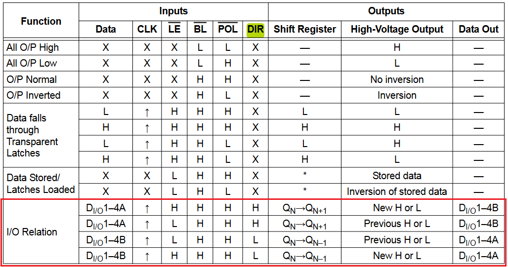


在 PCB 设计中，$DIR$ 的电平为高电平，且辉光管引脚连接如下：

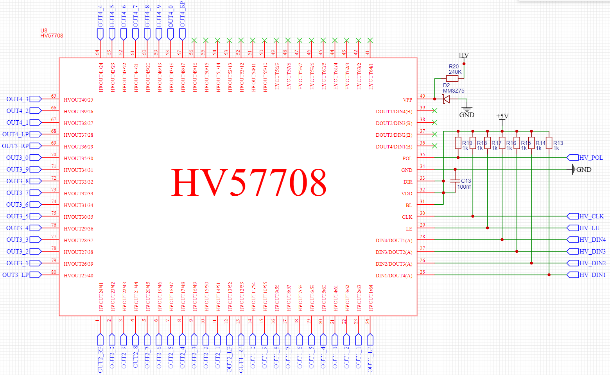

HV57708 的内部功能简图如下：  

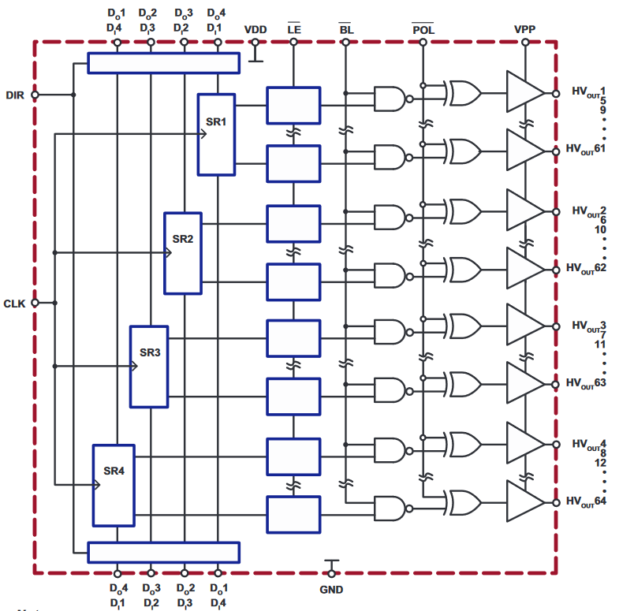

总共有 4 个移位寄存器，每一个寄存器控制右边 16 个引脚的输出，我们需要消耗一些时间来写满这 4 个寄存器。参考时序图，在每一个时钟信号的低电平期间修改数据，在时钟信号的高电平期间数据会被写入移位寄存器中，重复 16 次即可写满这 4 个寄存器。

为了方便 64 位数据在程序上方便写入，每一个移位寄存器所控制的引脚并非连续的，如图 SR4 对应的引脚就是 4, 8, 12..., 64。举个例子，我们有一个 64 位数据，我们从高位到低位进行写入。第一次循环，移位寄存器移位一次 ($Q_N→Q_{N+1}$) 随后 64位写入SR4，63位写入SR3，...，61位写入SR1。第二次循环，64到61位被移一位后，60到57位分别被写入SR4到SR1；重复这个过程，最后数据的64位就会被移动到HVOUT64，63位会被移动到HVOUT63，...，61位会被移动到HVOUT61，数据的每一位正好和HVOUT的标号对应。

当所有的串行数据都被写入到移位寄存器中之后，就可以拉高 $\overline{LE}$ 将数据写入锁存器中。

结合原理图，$DIR$ 为高电平，芯片从右下角顺时针引脚为HVOUT1$\sim$HVOUT64，辉光管的管编号对应为1$\sim$4，在PCB中的设置顺序为从左到右，因此我们可以考虑分两步实现：

1. 将每一个辉光管需要显示的数据 `u8 data[4]` 映射为一个 64 位的数据：

   ```C
   /**
    * void HV57708_Display(u8 *data)
    * 简介：在辉光管上显示数据
    * 功能：在辉光管上显示数据
    * 输入：data，数组从0开始，对应PCB板上从左开始的辉光管
   		 data的元素0~9对应相应的显示数字，元素10对应左小数点，11对应右小数点，12对应不显示
    * 输出：无
    */
   void HV57708_Display(u8 *data)
   {	
   	u8 hvout_x, i, temp;  	
   	u32 LSB = 0, MSB = 0;
   	for(i = 0; i < 4; i++)
   	{	
   		//首先修改data[i]的值，使之与PCB设计的引脚排列对应
   		if (data[i] == 12) continue;
   		if(data[i] >= 1 && data[i] <= 9) temp = data[i];
   		else if (data[i] == 0) temp = 10;
   		else if (data[i] == 10) temp = 0;
   		else temp = 11;
           //确定辉光管显示数字对应HV57708的HVOUT(x), 0~63
   		hvout_x = i * 12 + temp;
   	    if(hvout_x < 32)   LSB |= 1 << hvout_x;
   		else               MSB |= 1 << (hvout_x - 32);
   	}
   	HV57708_SendData(MSB, LSB);
   	HV57708_OutputData();
   }
   ```

2. 将 64 位数据分 16 次写入移位寄存器中，最后将4个移位寄存器的数据进行锁存，从而完成整个串行到并行的输出：

   ```C
   /**
    * void HV57708_SendData(u32 datapart1, u32 datapart2)
    * 简介：向 HV57708 发送数据
    * 功能：向 HV57708 发送 64 位的数据
    * 输入：
    *       datapart1 - 低32位数据
    *       datapart2 - 高32位数据
    * 输出：无
    */
   void HV57708_SendData(u32 datapart2, u32 datapart1)
   {
   	u8 i;
   	u32 tmp;
   	tmp = datapart2;
   	for(i = 0; i < 8; i++)
       {
   		HV57708_CLK = 0;
   
   		HV57708_DI4 = (tmp & 0x80000000);
   		tmp = tmp << 1;
   
   		HV57708_DI3 = (tmp & 0x80000000);
   		tmp = tmp << 1;
   
   		HV57708_DI2 = (tmp & 0x80000000);
   		tmp = tmp << 1;
   
   		HV57708_DI1 = (tmp & 0x80000000);
   		tmp = tmp << 1;
   
   		Delay(20);
   		HV57708_CLK = 1;
   		Delay(20);
   	}
   	tmp = datapart2;
   	for(i=0; i < 8; i++)
   	{
   		HV57708_CLK = 0;
   		HV57708_DI4 = (tmp & 0x80000000);
   		tmp = tmp << 1;
   
   		HV57708_DI3 = (tmp & 0x80000000);
   		tmp = tmp << 1;
   
   		HV57708_DI2 = (tmp & 0x80000000);
   		tmp = tmp << 1;
   
   		HV57708_DI1 = (tmp & 0x80000000);
   		tmp = tmp << 1;
   
   		Delay(20);
   		HV57708_CLK = 1;
   		Delay(20);
   		HV57708_CLK = 0;
   		Delay(20);		
   	}
   }
   ```

3. 锁存寄存器数据，完成并行数据输出：

   ```C
   /**
    * void HV57708_OutputData(void)
    * 简介：将 HV57708 寄存器中的数据输出至引脚
    * 功能：将 HV57708 寄存器中的数据输出至引脚
    * 输入：无
    * 输出：无
    */
   void HV57708_OutputData(void)
   {
   	HV57708_LE = 1;  //数据写入锁存器
   	Delay(50);
   	HV57708_LE = 0;  //数据锁存
   	Delay(20);
   }
   ```


#### 3.2.2 与WiFi模块的通信

本身最初设计上是想让STM32使用UART发送AT指令驱动WiFi模块的，让WiFi模块基于NTP协议来获取网络时间，从而纠正 DS1302 时间长之后可能会出现的计时误差。但是一不注意没有将二者的串口引脚交叉相接，等焊好测试的时候才发现这个问题，硬件上已经没有办法补救了，只能从软件上考虑能不能救一下了。

好在是当初为了防止WiFi模块的AT固件可能出现问题，预留了WiFi模块的程序下载接口。既然如此，那就直接对这块 ESP8266 进行编程吧，将两个端口作为普通 IO 口来使用，一个作为时间信号，一个作为数据信号。

设计上，一个IO口作为时钟信号来触发STM32的外部中断，当该中断发生时，将另一个 IO 口上的电平状态作为一位数据进行读入，相当于实现了一个非常简陋的“通信协议”。由于 DS1302 一年也就存在约一分钟的计时误差，所以仅在上电之后 ESP8266 会发送一次网络时间数据给 STM32 来纠正计时误差。

另外，基于Arduino 平台对 ESP8266 进行编程，顺便还使用了一下 WiFiManager 这个库来让用户完成对家中 WiFi 的名称和密码的配置。


#### 3.2.3 其他模块

其他模块相对而言都比较常见了。

- 温湿度模块 GXHT30 芯片基于 I2C 协议与 STM32 进行通信

- 时钟模块 DS1302 使用非常类似于 I2C 的通信时序与 STM32 进行通信

- 氛围灯 WS2812 使用一位数据线，串行发送24bit颜色数据。使用不同占空比的高低电平表示逻辑高低电平。因此使用定时器的输出比较功能不断输出这两种占空比的 PWM 波 （为了减少 MCU 资源占用，还可以使用 DMA 来完成比较寄存器 CCR 的值的快速重装）

  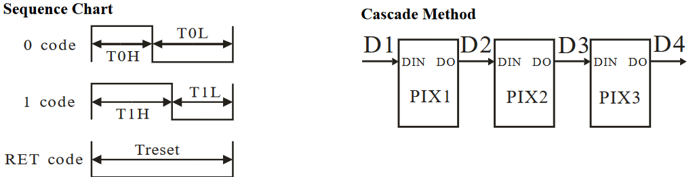

最后是无源蜂鸣器5050，为了能整点花样，让蜂鸣器来演奏一些和辉光管比较搭配的音乐。同样是使用定时器的输出比较功能来产生 PWM 波。不同占空比的 PWM 波能激发蜂鸣器发出不同的音符，控制 PWM 波的输出时间能控制每一个音符的持续时间，这样就能够简单演奏一首音乐了。


## 4. 外观

### 4.1 PCB外观

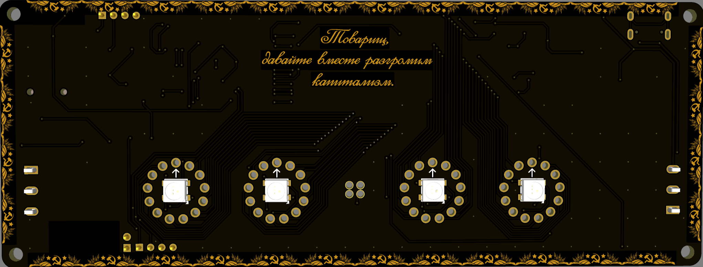

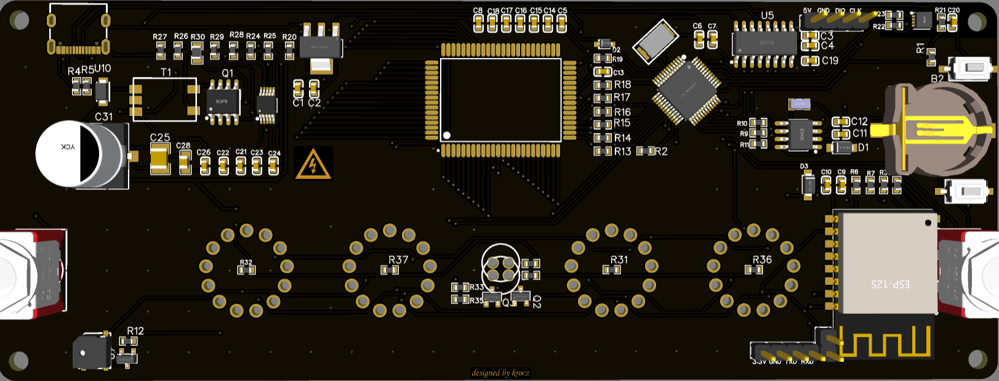

设计上将几乎所有元器件都放在了背面，使得正面看起来还是非常简洁大方的。使用黑色漆加上沉金工艺，整体的搭配还是非常好看的。


### 4.2 外壳

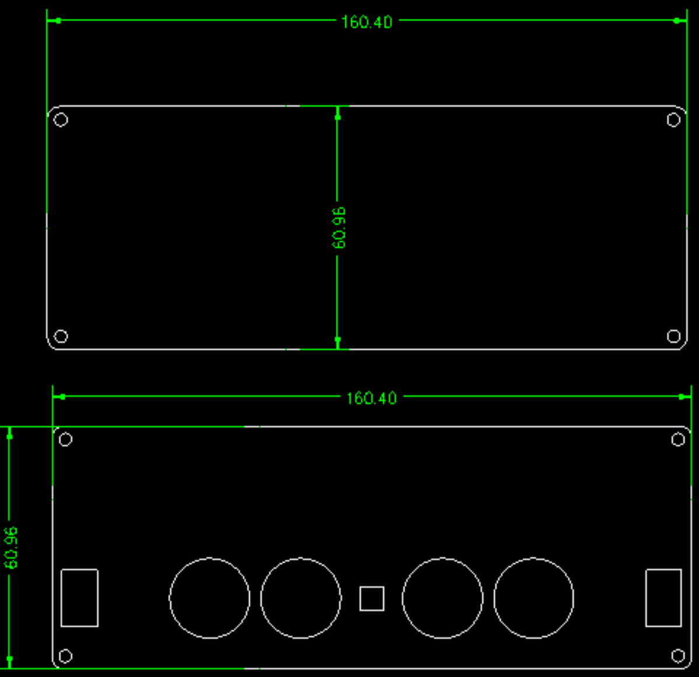

外壳就简单使用 CAD 绘制了上下两张亚克力板，在淘宝随便找一家加工一下就行，上板使用 3.6mm 的透明亚克力板，下板使用 4.5mm 的黑色不透明的亚克力板。实际效果还是略厚的，两块板子完全可以在降低一个档位的厚度。


### 4.3 整体效果

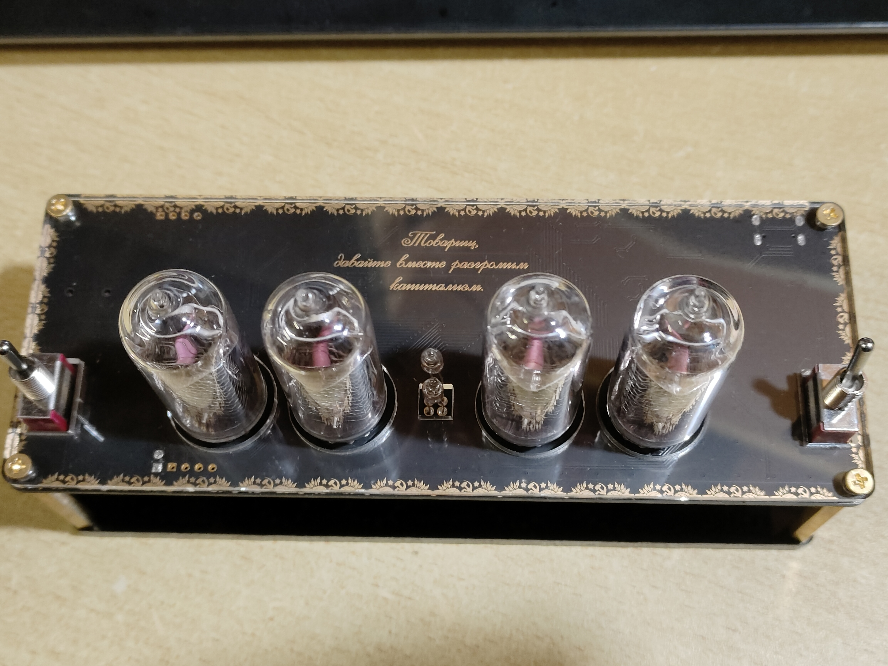


## 5.总结

之前本科时就想学画 PCB，以为画 PCB需要先把电路三件套都学完才能会画吧。实际体验了整个绘制流程，这个想法既对也不对，从零开始自己设计电路的每一个细节确实非常需要电路知识，而现在网上开源的电路设计非常多，如果只是将这些设计进行简单拼接以实现自己的目标，那还是相对容易的。在没有精力学电路知识之前，未来还是就这样站在巨人的肩膀上，达成自己的目标，相比这一次可能会更加减少自己的 PCB 设计部分吧 （因为出了问题是真的不会解决:(  ）。此外，立创EDA较低的使用门槛，立创开源广场上众多开发者的开源设计，嘉立创的白嫖打板券都在本次的作品中为我提供了非常大的帮助，必须要致以诚挚的感谢！

辉光管时钟是我自看了石头门之后一直想做的作品，只是碍于大学时种种原因一直未能如愿。在研究生阶段，终于是定下心来决定学习不会的知识，将其实现出来。在这约半年的时间里，一直饱受科研做实验的折磨，并没有过多的心力来推进项目的进展，以至于拖得周期非常长，在最后并没有尽善尽美的把它做好，稍有一些遗憾。

我本人更想要一款更具有实用意义的伪辉光管时钟，所以这款真辉光管时钟的设计上特意添加了很多苏联的元素，是送给一位"精苏"的朋友的，也是缅怀那个因崇高理想而创建的伟大国家。


## 6.参考链接

我的开源：[krocz/My_NixieClock (github.com)](https://github.com/krocz/My_NixieClock/tree/main)

> 软硬件参考：
>
> [zzx0226/IN14_NIXIEClock (github.com)](https://github.com/zzx0226/IN14_NIXIEClock)
>
> [基于物联网的辉光管时钟系统 - 嘉立创EDA开源硬件平台 (oshwhub.com)](https://oshwhub.com/mmjx/ji-yu-wu-lian-wang-de-hui-guang-)
>
> [辉光管升压2333 - 嘉立创EDA开源硬件平台 (oshwhub.com)](https://oshwhub.com/xzfs/hui-guang-guan-sheng-ya-2333)
>
> [如何自己制作一个 divergense meter（辉光管时钟）？ - 知乎 (zhihu.com)](https://www.zhihu.com/question/34564116)


